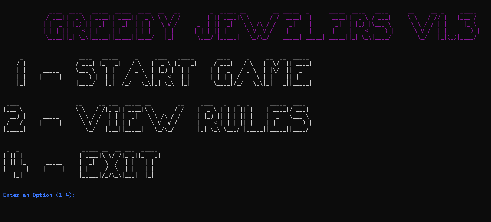
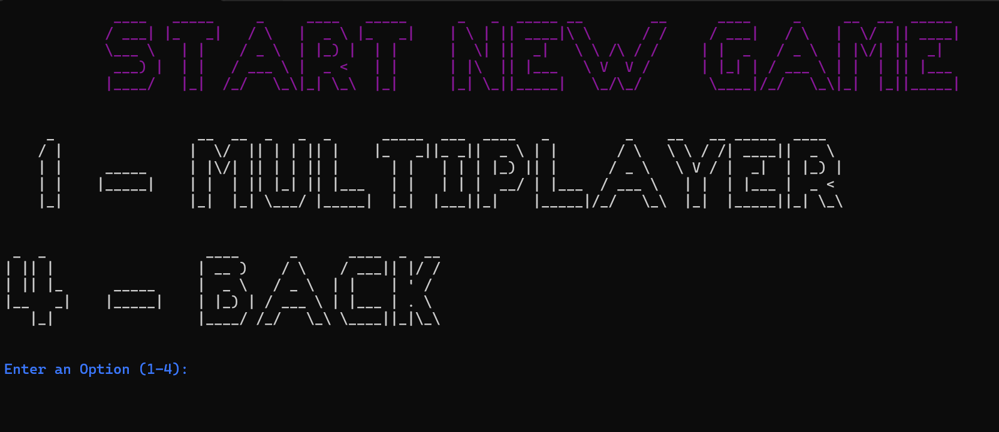
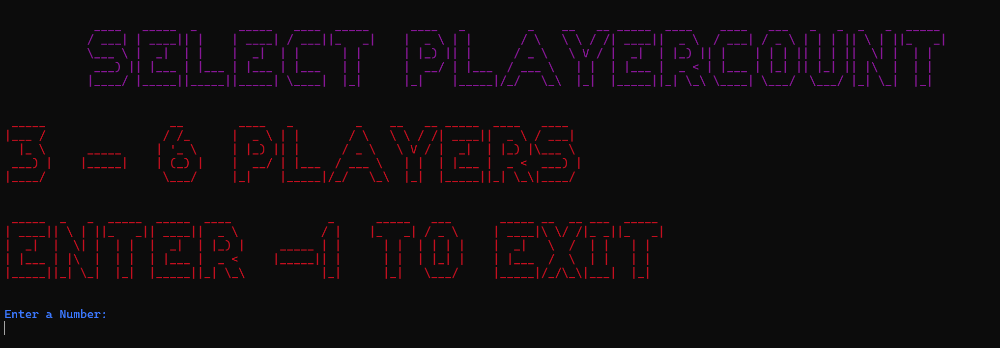
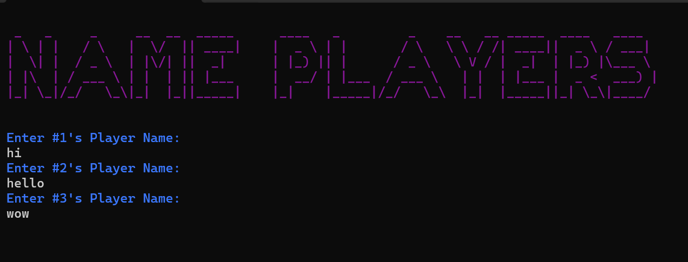
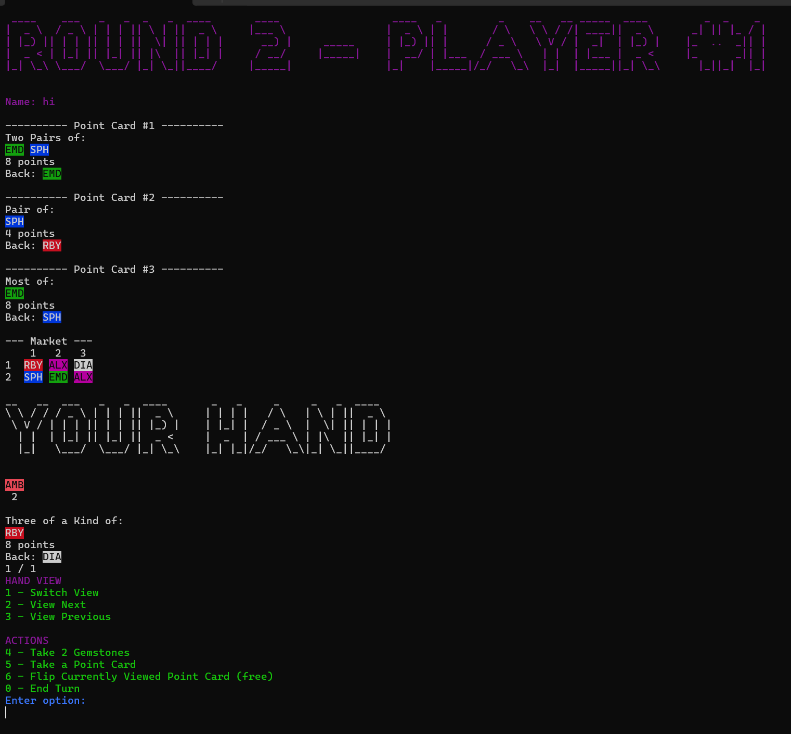
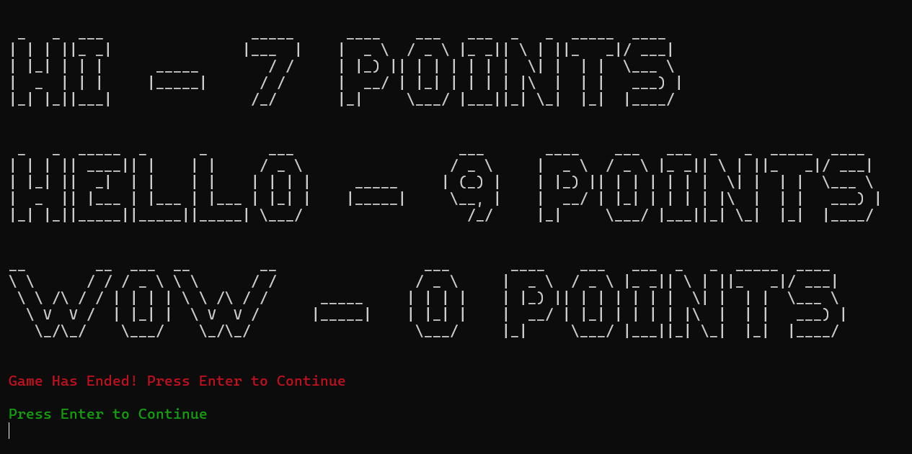

# Greedy Jewelers
*game based off Point Salad*

A local multiplayer card game implemented in Java for the command-line interface. The game can handle 3 to 6 players with a scaling deck according to the player count. The game is played on a 2 dimensional gird with 3 point cards and 6 gemstone cards to choose from. On each turn, a player can take 2 gemstones or 1 point card and/or flip any number of owned point cards to it's gemstone face. The game runs for 10 rounds.  

**Technology used:** Java 24  

## How to Run
1. Clone the repository: `git clone <<url>>` 
2. Run the **RunGame** Batch file or Shell script file

## Sample Gameplay

1. Start of game

2. One turn

3. End of game

#### Author: YBZ